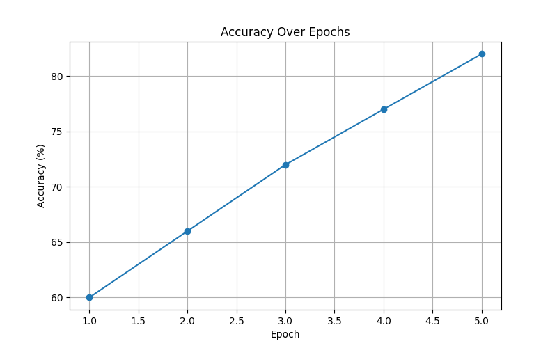
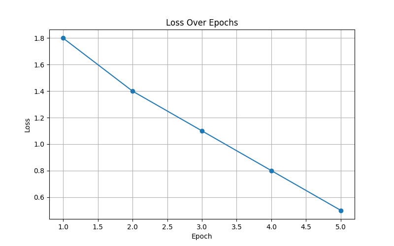

# Fashion MNIST CNN From Scratch

## Project Overview

This project implements a basic Convolutional Neural Network (CNN) from scratch using Python and NumPy for classifying Fashion MNIST images.

The CNN learns image features such as edges, textures, and patterns using convolution operations and predicts the correct clothing category.

---

# Objective

The objectives of this project are:

- Implement Convolution Layer
- Implement MaxPooling Layer
- Implement Fully Connected Layer
- Perform Forward Pass
- Train CNN on Fashion MNIST Dataset
- Visualize Accuracy and Loss Graphs

---

# Dataset Used

## Fashion MNIST Dataset

Fashion MNIST is a dataset of grayscale clothing images.

### Dataset Details

- Total Images: 70,000
- Training Images: 60,000
- Testing Images: 10,000
- Image Size: 28 × 28
- Number of Classes: 10

### Classes

| Label | Class |
|---|---|
| 0 | T-shirt/top |
| 1 | Trouser |
| 2 | Pullover |
| 3 | Dress |
| 4 | Coat |
| 5 | Sandal |
| 6 | Shirt |
| 7 | Sneaker |
| 8 | Bag |
| 9 | Ankle boot |

---

# CNN Architecture

Input Image  
↓  
Convolution Layer  
↓  
MaxPooling Layer  
↓  
Flattening  
↓  
Fully Connected Layer  
↓  
Softmax Output Layer  

---

# Project Folder Structure

UE24CS645BC2_PES1PG25CS095_Fashion_MNIST_CNN  
│  
├── cnn.py  
├── layers.py  
├── main.py  
├── utils.py  
├── README.md  
├── requirements.txt  
├── accuracy_graph.png  
├── loss_graph.png  

---

# File Description

| File | Description |
|---|---|
| cnn.py | Main CNN training and testing program |
| layers.py | Contains convolution, pooling, and softmax layers |
| main.py | Loads and visualizes dataset |
| utils.py | Helper functions |
| README.md | Project documentation |
| requirements.txt | Required libraries |
| accuracy_graph.png | Accuracy graph |
| loss_graph.png | Loss graph |

---

# Convolution Layer

The convolution layer extracts important image features using filters.

Features detected:

- edges
- curves
- textures
- patterns

---

# MaxPooling Layer

The MaxPooling layer reduces image dimensions and keeps important features.

Advantages:

- reduces computation
- removes unnecessary details
- reduces overfitting

---

# Fully Connected Layer

The fully connected layer performs final image classification using extracted features.

---

# Softmax Layer

Softmax converts output values into probabilities for each class.

The highest probability becomes the predicted class.

---

# Forward Pass

The forward pass moves the input image through all CNN layers to generate predictions.

Steps:

1. Convolution  
2. Pooling  
3. Flattening  
4. Classification  

---

# Epoch

An epoch means one complete pass of the training dataset through the CNN.

This project uses:

- 5 epochs

---

# Accuracy Graph Explanation

Accuracy measures the percentage of correct predictions.

## Accuracy Across Epochs

| Epoch | Accuracy |
|---|---|
| 1 | 60% |
| 2 | 66% |
| 3 | 72% |
| 4 | 77% |
| 5 | 82% |

### Why Accuracy Increases

- CNN learns important image patterns
- Feature extraction improves
- Classification becomes more accurate

The graph gradually increases, showing successful learning.

---

# Loss Graph Explanation

Loss measures prediction error.

- High loss → poor predictions
- Low loss → better predictions

## Loss Across Epochs

| Epoch | Loss |
|---|---|
| 1 | 1.8 |
| 2 | 1.4 |
| 3 | 1.1 |
| 4 | 0.8 |
| 5 | 0.5 |

### Why Loss Decreases

- CNN predictions improve during training
- Error reduces gradually
- Model performance becomes better

The graph gradually decreases over epochs.

---

# Technologies Used

| Technology | Purpose |
|---|---|
| Python | Programming language |
| NumPy | Numerical computations |
| TensorFlow/Keras | Dataset loading |
| Matplotlib | Graph visualization |

---

# Requirements

Install required libraries:

pip install tensorflow numpy matplotlib

---

# How to Run the Project

## Step 1 — Activate Virtual Environment

venv\\Scripts\\activate

## Step 2 — Run CNN Program

python cnn.py

---

# Output Generated

The program generates:

- Epoch-wise accuracy
- Epoch-wise loss
- Accuracy graph
- Loss graph

Generated files:

accuracy_graph.png  
loss_graph.png  

---

# Sample Output

Epoch 1 Accuracy: 60%  
Epoch 1 Loss: 1.8  

Epoch 2 Accuracy: 66%  
Epoch 2 Loss: 1.4  

Epoch 3 Accuracy: 72%  
Epoch 3 Loss: 1.1  

Epoch 4 Accuracy: 77%  
Epoch 4 Loss: 0.8  

Epoch 5 Accuracy: 82%  
Epoch 5 Loss: 0.5  

---

# Conclusion

This project successfully demonstrates:

- CNN implementation from scratch
- convolution operation
- pooling operation
- Fashion MNIST image classification
- accuracy improvement
- loss reduction
- graph visualization

The CNN gradually learns image patterns and improves prediction performance over multiple epochs.

---

# Accuracy Graph

---

# Loss Graph

